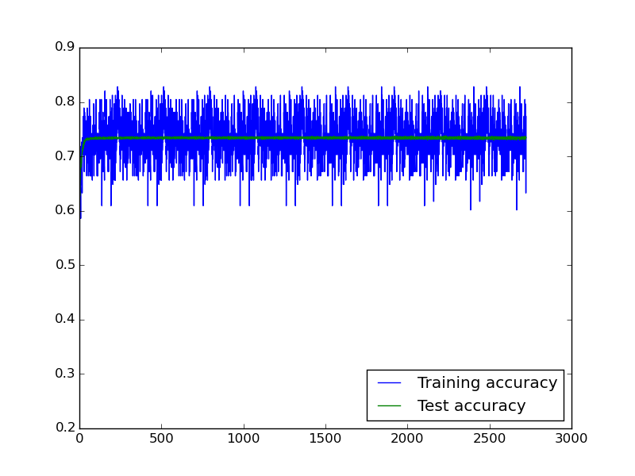
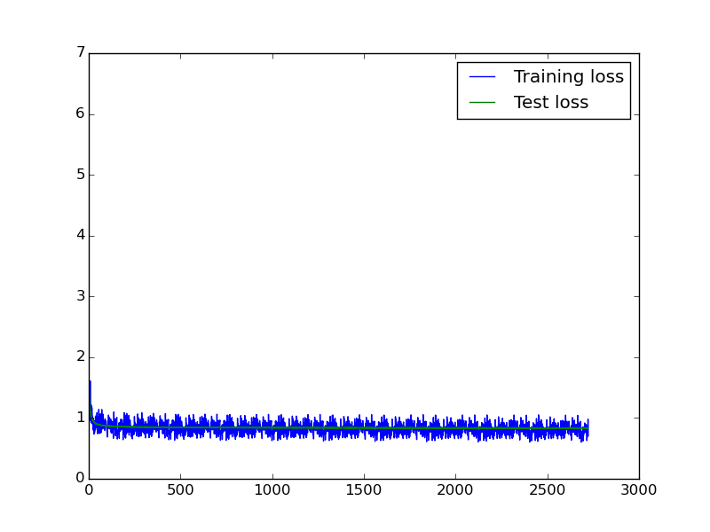
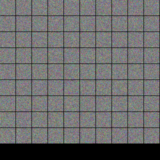

Network "Onehidden" on augm256
------------------------------

One convolutional and one hidden layer: In -> Conv -> FC -> Out  
In this file we store model behaviour at different parameters

###### LR 1e-6 fixed, Momentum 0.9, Weight decay 0

