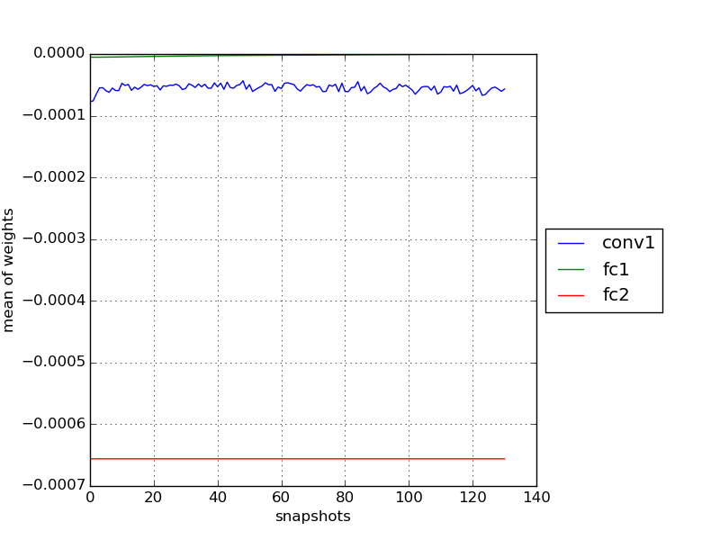
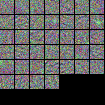

Network "Onehiddenpool" on augm256
------------------------------

One convolutional and one hidden layer with pooling and normalization: In -> Conv -> Pool -> Norm -> FC -> Out  
In this file we store model behaviour at different parameters

###### LR 1e-5 fixed, Momentum 0.9, Weight decay 0

