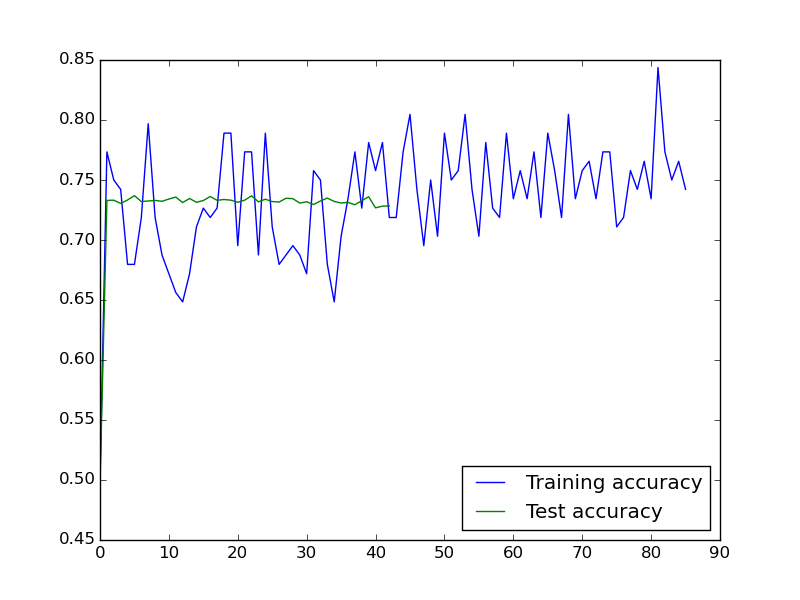
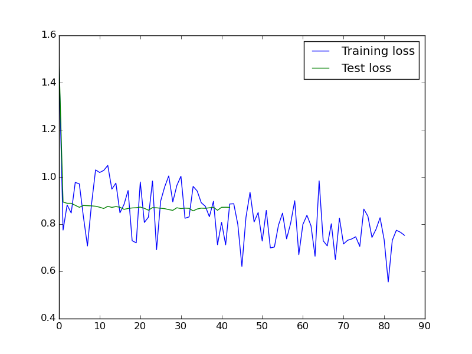
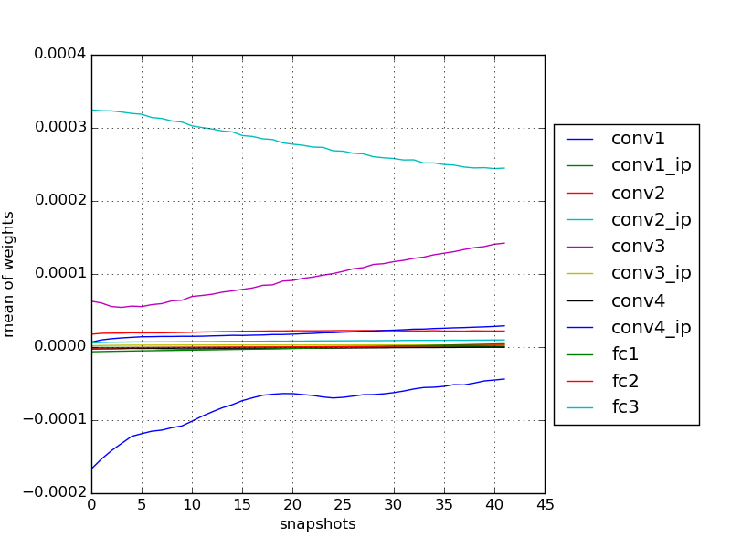
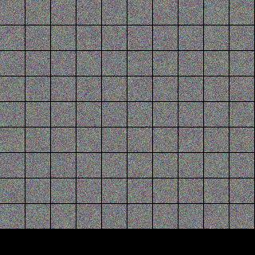
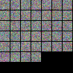
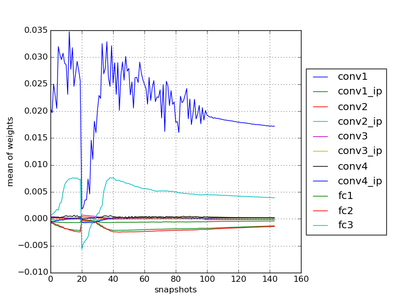
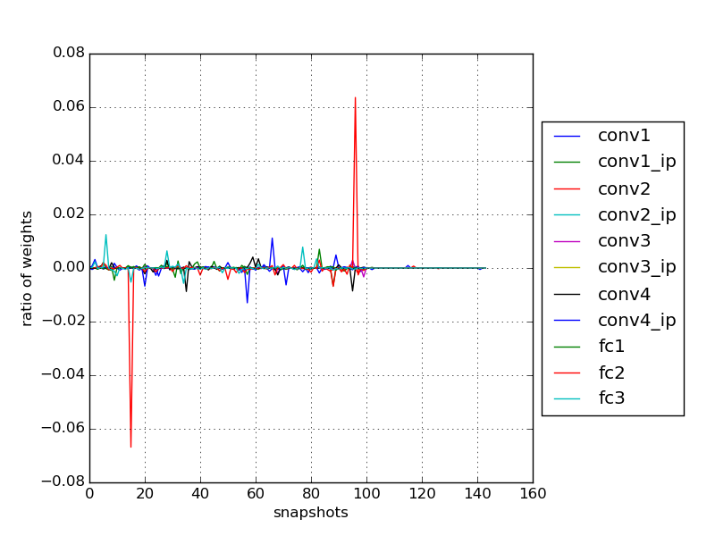
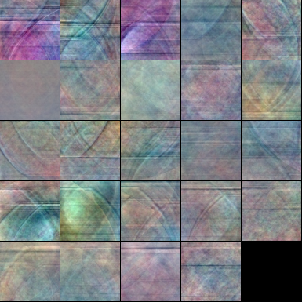

Network "Firstborn" on size256
------------------------------

[Put grapviz visualization of the netwohere]  
###### LR 0.00001 fixed, Momentum 0.9, Weight decay 0.0005

  

###### LR 0.001 fixed, Momentum 0.9, Weight decay 0.0005

  

