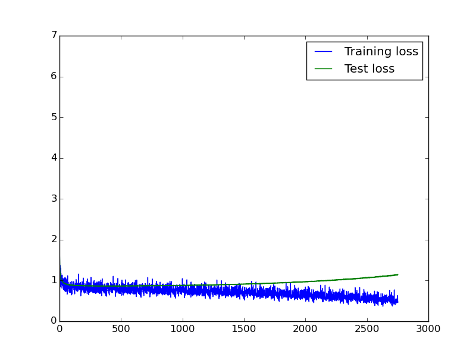

Network "Onehidden"
-----------------

One convolutional and one hidden layer: In -> Conv -> FC -> Out  
In this file we store model behaviour at different parameters

###### LR 0.000001 fixed, Momentum 0.9, Weight decay 0
  
